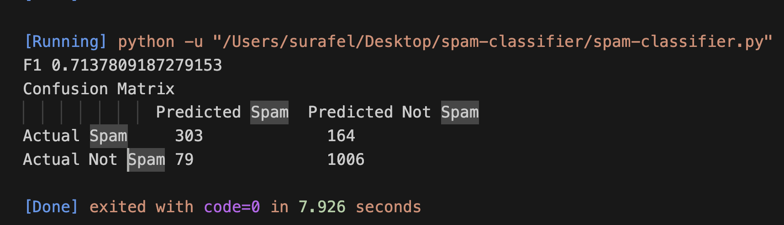

# Spam Classifier based on NLTK

The code in this project was developed for the course Natural Language Processing (2024/2025) for the Masters program in AI at the University of Verona. As requested on the assignment specification it uses [this spam email dataset](https://www.kaggle.com/datasets/balaka18/email-spam-classification-dataset-csv) and the `NaiveBayesClassifier` from the `nltk` library. It scores an `F1` score of `0.714` using all the 3000 words.
